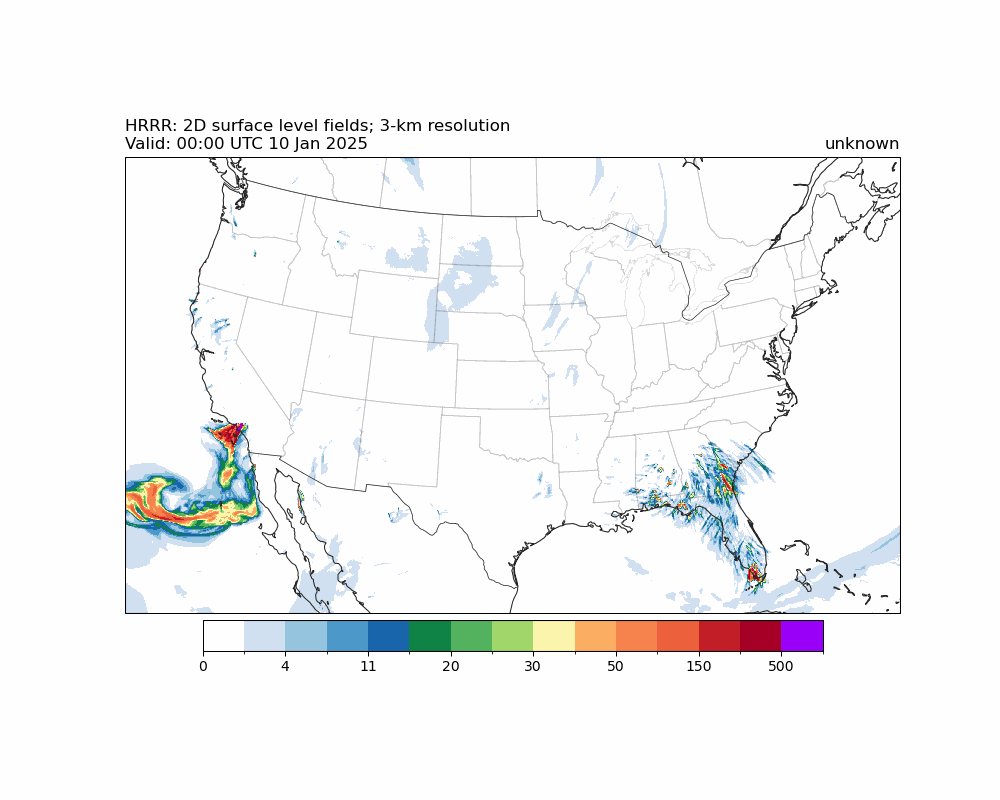

# hrrr-smoke-viz
Working with HRRR data to eventually use to train a Convolutional LSTM

# Setup environment 
Conda environment 
- CPU: `conda env create -f envs/cpu_environment.yml`
- GPU: `conda env create -f envs/gpu_environment.yml`

# Output of `hrrr_smoke_viz`: 12 hour forecast
## Mass density of smoke product

## Vertically-integrated smoke product

# Content
- `hrrr_smoke_viz` describes how to use `Herbie` to download HRRR data and visualize it.
    - **Use this notebook if you want to learn how to use Herbie, download HRRR data, and visualize the results.**
- `data` contains data used to train models -- things like AirNow sensors.
- `envs` contains the `yml` files used to create the `conda` environment.
- `experiments` contains the active experiments I am currently working on.
- `images` contains the images and gif created by the `hrrr_smoke_viz` notebook.
- `libs` contains the utility functions created to organize our data preprocessing.
- `tests` contains various notebooks and code snippets used to play around with the model, HRRR, and data preprocessing. It's more like an unorganized archive of experiments.
