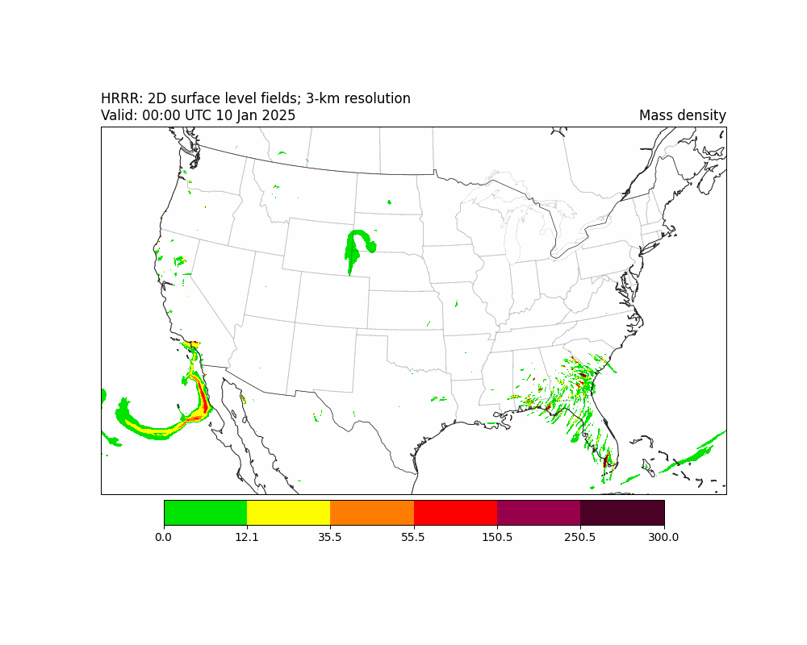

# hrrr-smoke-viz
Working with HRRR data to eventually use to train a Convolutional LSTM

# Setup environment 
You have two options:
- Python virtual environment (only runs notebooks without `wgrib2`)
- Conda environment (recommended)

1. Python venv. Just pop a virtual environment and run the notebook.

```bash
python3 -m venv venv
source venv/bin/activate
pip install -r requirements.txt
```

2. Conda env. This is the recommended way to run all the notebooks in this repository.

```bash
conda env create -f environment.yml
conda activate hrrrenv
```
# Output of `hrrr_smoke_viz`: 12 hour forecast


# Content
- `hrrr_smoke_viz` describes how to use `Herbie` to download HRRR data and visualize it.
- `hrrr_to_convlstm` describes the entire pipeline of creating the 5D tensor (samples, frames, rows, columns, channels) used as input for the ConvLSTM 
    - Downloading subsetted HRRR data
    - Using `Herbie's` `wrgrib2` wrapper to subregion the data
    - Converting the frames to `numpy` format
    - Downsampling the frames 
    - Creating multiple samples using a sliding window of frames
