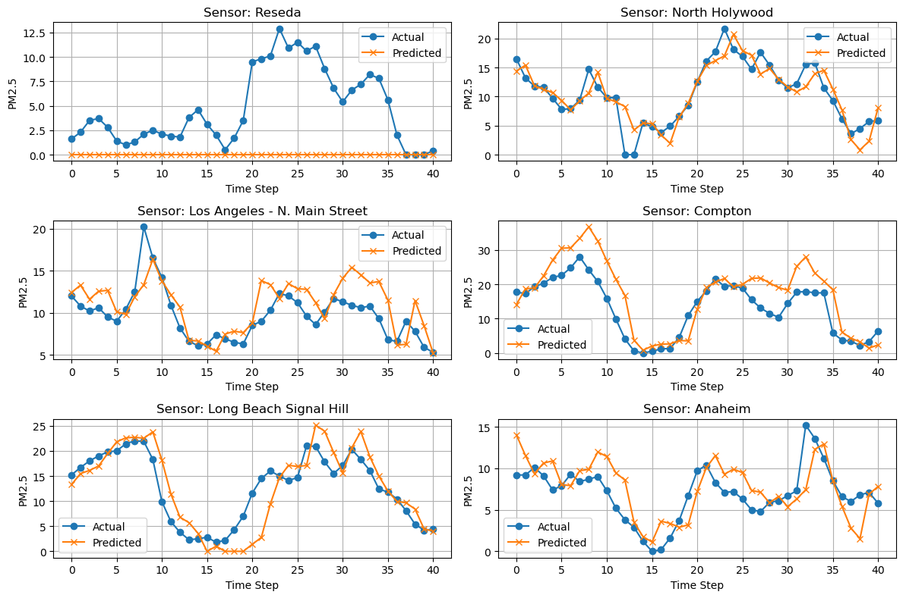
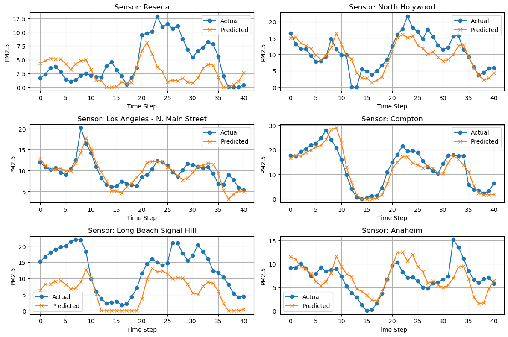
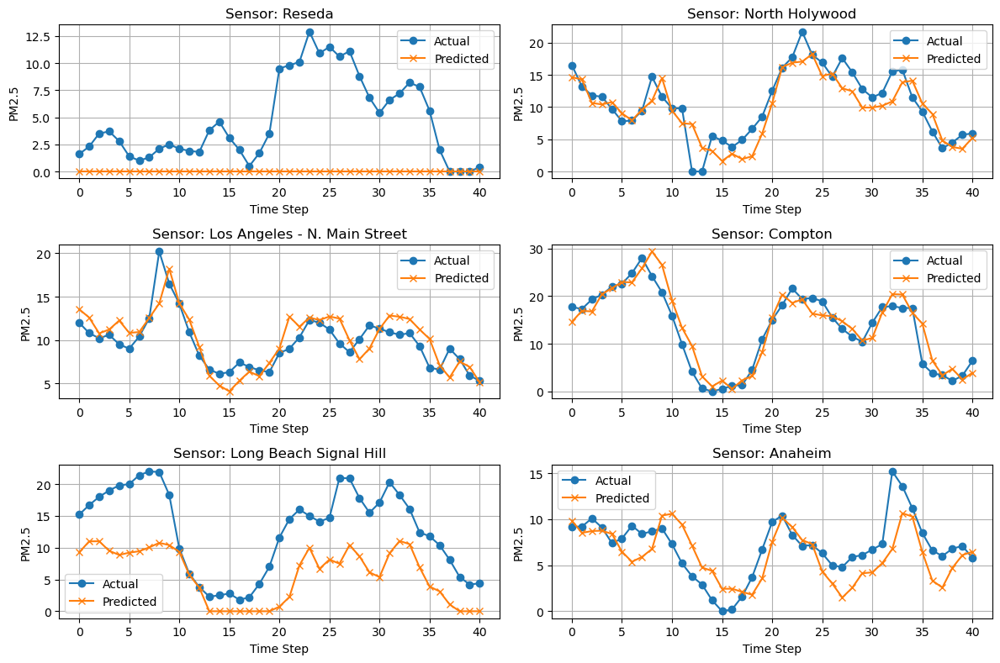

# Experiments 
## Experiment set 1: week of April 7th, 2025
### Summary
Three experiments with the goal of examining the effect of HRRR on the model's predicitive power for predicting next-frame AirNow PM2.5 stations.

### Settings
- Nearest neighbor interpolation for AirNow sensors.
- ~0.7 degree square bounding box, with 40x40 dimensions.
- 5 frames per sample, sliding window offset by 1 frame. Roughly 164 samples.
- Basic ConvLSTM model.

### Experiment
1. AirNow sensors as only channel.
2. HRRR and AirNow, both matching frames.
3. HRRR with 5-frame future forecast and AirNow \*

\* For a sample, AirNow uses frames at time [0, 4]; HRRR uses forecasts initialized at time 4, forecasting frames at time [5, 9]

### Results
1. AirNow
```
RESULTS
---------------------------------------------------------------------------
All Days All Locations - y_pred vs y_test Raw RMSE: 4.34
All Days All Locations - y_pred vs y_test RMSE Percent Error of Mean: 45.00%

RESULTS BY FRAME
---------------------------------------------------------------------------
Frame 1 (Hour 1) All Locations - Raw RMSE: 2.80
Frame 1 (Hour 1) All Locations - RMSE Percent Error of Mean: 23.24%

Frame 2 (Hour 2) All Locations - Raw RMSE: 2.05
Frame 2 (Hour 2) All Locations - RMSE Percent Error of Mean: 17.69%

Frame 3 (Hour 3) All Locations - Raw RMSE: 1.76
Frame 3 (Hour 3) All Locations - RMSE Percent Error of Mean: 14.46%

Frame 4 (Hour 4) All Locations - Raw RMSE: 2.19
Frame 4 (Hour 4) All Locations - RMSE Percent Error of Mean: 17.67%

Frame 5 (Hour 5) All Locations - Raw RMSE: 3.06
Frame 5 (Hour 5) All Locations - RMSE Percent Error of Mean: 25.80%

RESULTS BY SENSOR LOCATION
---------------------------------------------------------------------------
All Days - Reseda Raw RMSE: 6.02
All Days - Reseda RMSE Percent Error of Mean: 128.29%

All Days - North Holywood Raw RMSE: 2.48
All Days - North Holywood RMSE Percent Error of Mean: 23.45%

All Days - Los Angeles - N. Main Street Raw RMSE: 2.53
All Days - Los Angeles - N. Main Street RMSE Percent Error of Mean: 26.03%

All Days - Compton Raw RMSE: 6.32
All Days - Compton RMSE Percent Error of Mean: 48.05%

All Days - Long Beach Signal Hill Raw RMSE: 4.12
All Days - Long Beach Signal Hill RMSE Percent Error of Mean: 32.22%

All Days - Anaheim Raw RMSE: 2.74
All Days - Anaheim RMSE Percent Error of Mean: 39.17%
```


2. HRRR+AirNow (frame-by-frame)
```
RESULTS
---------------------------------------------------------------------------
All Days All Locations - y_pred vs y_test Raw RMSE: 4.38
All Days All Locations - y_pred vs y_test RMSE Percent Error of Mean: 45.43%

RESULTS BY FRAME
---------------------------------------------------------------------------
Frame 1 (Hour 1) All Locations - Raw RMSE: 4.01
Frame 1 (Hour 1) All Locations - RMSE Percent Error of Mean: 33.29%

Frame 2 (Hour 2) All Locations - Raw RMSE: 3.80
Frame 2 (Hour 2) All Locations - RMSE Percent Error of Mean: 32.83%

Frame 3 (Hour 3) All Locations - Raw RMSE: 4.18
Frame 3 (Hour 3) All Locations - RMSE Percent Error of Mean: 34.40%

Frame 4 (Hour 4) All Locations - Raw RMSE: 4.15
Frame 4 (Hour 4) All Locations - RMSE Percent Error of Mean: 33.52%

Frame 5 (Hour 5) All Locations - Raw RMSE: 4.60
Frame 5 (Hour 5) All Locations - RMSE Percent Error of Mean: 38.75%

RESULTS BY SENSOR LOCATION
---------------------------------------------------------------------------
All Days - Reseda Raw RMSE: 4.37
All Days - Reseda RMSE Percent Error of Mean: 93.19%

All Days - North Holywood Raw RMSE: 3.32
All Days - North Holywood RMSE Percent Error of Mean: 31.39%

All Days - Los Angeles - N. Main Street Raw RMSE: 1.95
All Days - Los Angeles - N. Main Street RMSE Percent Error of Mean: 20.01%

All Days - Compton Raw RMSE: 3.18
All Days - Compton RMSE Percent Error of Mean: 24.21%

All Days - Long Beach Signal Hill Raw RMSE: 7.95
All Days - Long Beach Signal Hill RMSE Percent Error of Mean: 62.12%

All Days - Anaheim Raw RMSE: 2.86
All Days - Anaheim RMSE Percent Error of Mean: 40.97%
```


3. HRRR+AirNow (HRRR 5-frame forecast)
```
RESULTS
---------------------------------------------------------------------------
All Days All Locations - y_pred vs y_test Raw RMSE: 4.53
All Days All Locations - y_pred vs y_test RMSE Percent Error of Mean: 46.98%

RESULTS BY FRAME
---------------------------------------------------------------------------
Frame 1 (Hour 1) All Locations - Raw RMSE: 3.00
Frame 1 (Hour 1) All Locations - RMSE Percent Error of Mean: 24.90%

Frame 2 (Hour 2) All Locations - Raw RMSE: 2.67
Frame 2 (Hour 2) All Locations - RMSE Percent Error of Mean: 23.07%

Frame 3 (Hour 3) All Locations - Raw RMSE: 3.44
Frame 3 (Hour 3) All Locations - RMSE Percent Error of Mean: 28.33%

Frame 4 (Hour 4) All Locations - Raw RMSE: 4.20
Frame 4 (Hour 4) All Locations - RMSE Percent Error of Mean: 33.89%

Frame 5 (Hour 5) All Locations - Raw RMSE: 4.78
Frame 5 (Hour 5) All Locations - RMSE Percent Error of Mean: 40.31%

RESULTS BY SENSOR LOCATION
---------------------------------------------------------------------------
All Days - Reseda Raw RMSE: 6.02
All Days - Reseda RMSE Percent Error of Mean: 128.29%

All Days - North Holywood Raw RMSE: 2.61
All Days - North Holywood RMSE Percent Error of Mean: 24.74%

All Days - Los Angeles - N. Main Street Raw RMSE: 1.92
All Days - Los Angeles - N. Main Street RMSE Percent Error of Mean: 19.74%

All Days - Compton Raw RMSE: 2.77
All Days - Compton RMSE Percent Error of Mean: 21.05%

All Days - Long Beach Signal Hill Raw RMSE: 7.89
All Days - Long Beach Signal Hill RMSE Percent Error of Mean: 61.67%

All Days - Anaheim Raw RMSE: 2.59
All Days - Anaheim RMSE Percent Error of Mean: 37.03%
```


### Thoughts
- Long Beach Signal Hill being difficult to predict is likely due to elevation differences affecting how smoke is moving across the terrain. IDW interpolation will likely fix this.
- The model failing to make predictions for Reseda may be due to boundary issues, though the data of Reseda seems fine. Will require more investigating.
- Among the predictors, it seems like the predictions are lagging behind the actual. The idea here is that the model is waiting for the previous frame to come in, and use that to predict the current frame because it's close enough. That is, the model isn't making predictions, it's simply using last frame to "predict" the current frame.
- In general, it does seem like HRRR is helping the model make better predictions, if only slightly.
