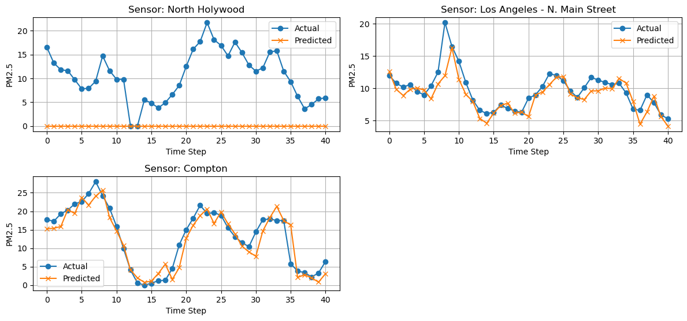
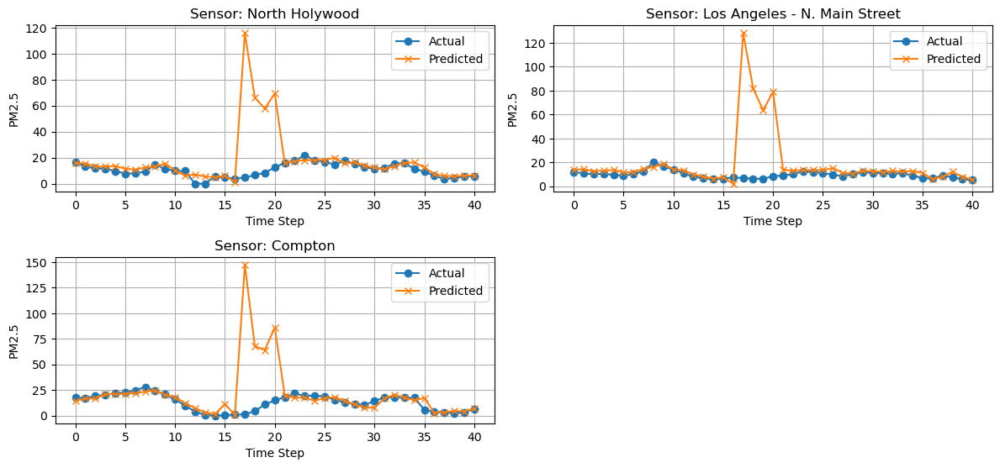
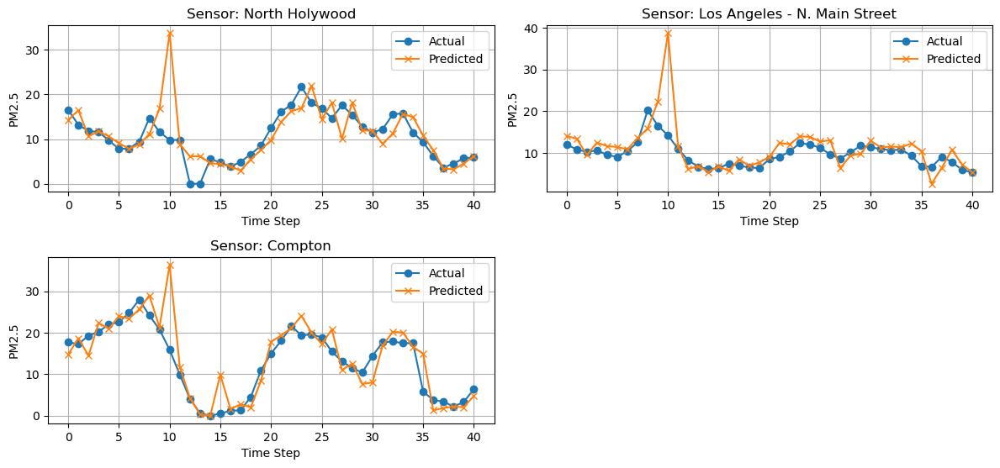

# Experiment
## Experiment 2 - week of April 14th, 2025
### Summary
Three experiments with the goal of examining the effect of HRRR on the model's predicitive power for predicting next-frame AirNow PM2.5 stations.

### Settings
- Nearest neighbor interpolation for AirNow sensors.
- ~0.3 degree square bounding box, with 200x200 dimensions.
- 5 frames per sample, sliding window offset by 1 frame. Roughly 164 samples.
- Basic ConvLSTM model.
- Predicting 3 sensors

### Experiment
1. AirNow sensors as only channel.
2. HRRR and AirNow, both matching frames.
3. HRRR with 5-frame future forecast and AirNow

### Results
1. Airnow
```
RESULTS
---------------------------------------------------------------------------
All Days All Locations - y_pred vs y_test Raw RMSE: 7.07
All Days All Locations - y_pred vs y_test RMSE Percent Error of Mean: 63.45%

RESULTS BY FRAME
---------------------------------------------------------------------------
Frame 1 (Hour 1) All Locations - Raw RMSE: 9.64
Frame 1 (Hour 1) All Locations - RMSE Percent Error of Mean: 62.57%

Frame 2 (Hour 2) All Locations - Raw RMSE: 7.72
Frame 2 (Hour 2) All Locations - RMSE Percent Error of Mean: 56.07%

Frame 3 (Hour 3) All Locations - Raw RMSE: 7.14
Frame 3 (Hour 3) All Locations - RMSE Percent Error of Mean: 51.84%

Frame 4 (Hour 4) All Locations - Raw RMSE: 6.71
Frame 4 (Hour 4) All Locations - RMSE Percent Error of Mean: 47.37%

Frame 5 (Hour 5) All Locations - Raw RMSE: 5.81
Frame 5 (Hour 5) All Locations - RMSE Percent Error of Mean: 42.30%

RESULTS BY SENSOR LOCATION
---------------------------------------------------------------------------
All Days - North Holywood Raw RMSE: 11.73
All Days - North Holywood RMSE Percent Error of Mean: 111.08%

All Days - Los Angeles - N. Main Street Raw RMSE: 1.83
All Days - Los Angeles - N. Main Street RMSE Percent Error of Mean: 18.84%

All Days - Compton Raw RMSE: 2.99
All Days - Compton RMSE Percent Error of Mean: 22.77%
```


2. HRRR+AirNow (frame-by-frame)
```
RESULTS
---------------------------------------------------------------------------
All Days All Locations - y_pred vs y_test Raw RMSE: 26.21
All Days All Locations - y_pred vs y_test RMSE Percent Error of Mean: 235.16%

RESULTS BY FRAME
---------------------------------------------------------------------------
Frame 1 (Hour 1) All Locations - Raw RMSE: 2.31
Frame 1 (Hour 1) All Locations - RMSE Percent Error of Mean: 14.99%

Frame 2 (Hour 2) All Locations - Raw RMSE: 2.47
Frame 2 (Hour 2) All Locations - RMSE Percent Error of Mean: 17.96%

Frame 3 (Hour 3) All Locations - Raw RMSE: 2.23
Frame 3 (Hour 3) All Locations - RMSE Percent Error of Mean: 16.18%

Frame 4 (Hour 4) All Locations - Raw RMSE: 1.76
Frame 4 (Hour 4) All Locations - RMSE Percent Error of Mean: 12.43%

Frame 5 (Hour 5) All Locations - Raw RMSE: 3.36
Frame 5 (Hour 5) All Locations - RMSE Percent Error of Mean: 24.48%

RESULTS BY SENSOR LOCATION
---------------------------------------------------------------------------
All Days - North Holywood Raw RMSE: 23.08
All Days - North Holywood RMSE Percent Error of Mean: 218.44%

All Days - Los Angeles - N. Main Street Raw RMSE: 26.58
All Days - Los Angeles - N. Main Street RMSE Percent Error of Mean: 273.29%

All Days - Compton Raw RMSE: 28.66
All Days - Compton RMSE Percent Error of Mean: 218.07%
```


3. HRRR+AirNow (5-frame-forecast)
```
RESULTS
---------------------------------------------------------------------------
All Days All Locations - y_pred vs y_test Raw RMSE: 4.53
All Days All Locations - y_pred vs y_test RMSE Percent Error of Mean: 40.64%

RESULTS BY FRAME
---------------------------------------------------------------------------
Frame 1 (Hour 1) All Locations - Raw RMSE: 2.39
Frame 1 (Hour 1) All Locations - RMSE Percent Error of Mean: 15.55%

Frame 2 (Hour 2) All Locations - Raw RMSE: 2.52
Frame 2 (Hour 2) All Locations - RMSE Percent Error of Mean: 18.34%

Frame 3 (Hour 3) All Locations - Raw RMSE: 2.88
Frame 3 (Hour 3) All Locations - RMSE Percent Error of Mean: 20.92%

Frame 4 (Hour 4) All Locations - Raw RMSE: 1.60
Frame 4 (Hour 4) All Locations - RMSE Percent Error of Mean: 11.29%

Frame 5 (Hour 5) All Locations - Raw RMSE: 1.44
Frame 5 (Hour 5) All Locations - RMSE Percent Error of Mean: 10.45%

RESULTS BY SENSOR LOCATION
---------------------------------------------------------------------------
All Days - North Holywood Raw RMSE: 4.69
All Days - North Holywood RMSE Percent Error of Mean: 44.39%

All Days - Los Angeles - N. Main Street Raw RMSE: 4.41
All Days - Los Angeles - N. Main Street RMSE Percent Error of Mean: 45.31%

All Days - Compton Raw RMSE: 4.49
All Days - Compton RMSE Percent Error of Mean: 34.14%
```

