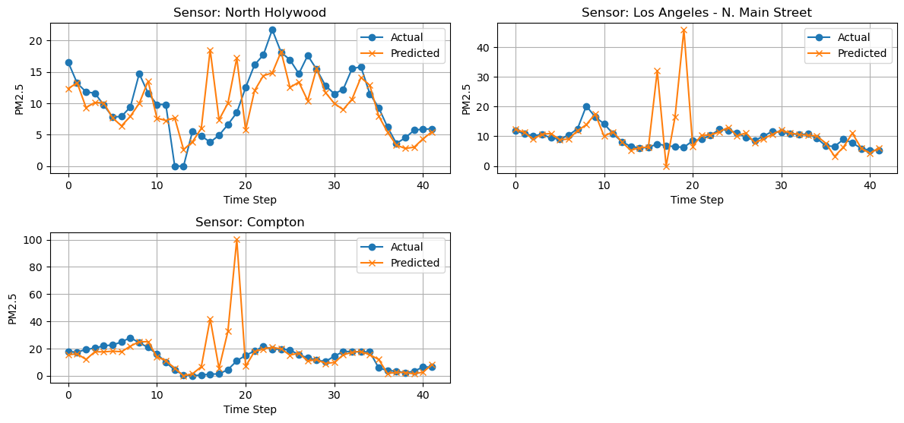
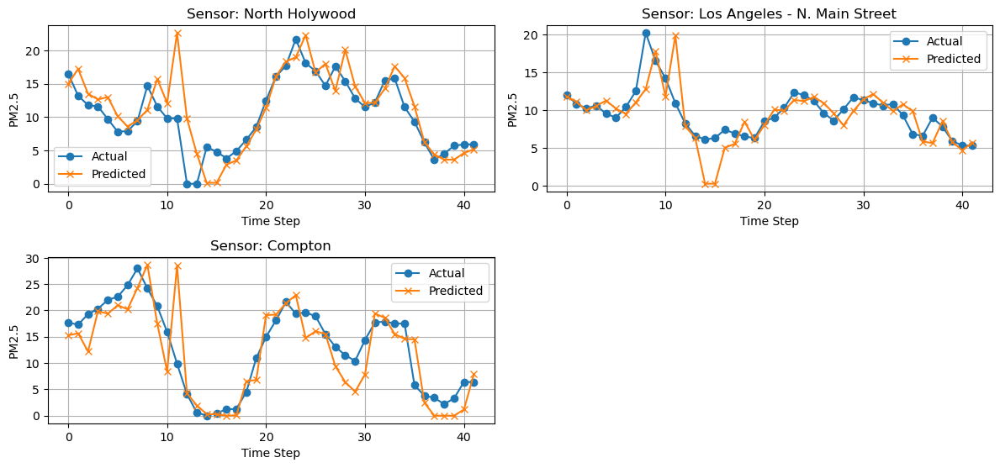

# Experiment
## Experiment set 3: week of April 14th, 2025
### Summary
Three experiments with the goal of examining the effect of HRRR on the model's predicitive power for predicting next-frame AirNow PM2.5 stations.
### Settings
- IDW interpolation for AirNow sensors.
- **NEW** Batch size 16 -> 4.
- ~0.3 degree square bounding box, with 200x200 dimensions.
- 5 frames per sample, sliding window offset by 1 frame. 165 samples.
- Basic ConvLSTM model.
- Predicting 3 sensors
### Experiment
1. AirNow sensors as only channel.
2. HRRR and AirNow, both matching frames.
3. HRRR with 5-frame future forecast and AirNow
### Results
1. AirNow
```
RESULTS
---------------------------------------------------------------------------
All Days All Locations - y_pred vs y_test Raw RMSE: 3.45
All Days All Locations - y_pred vs y_test RMSE Percent Error of Mean: 31.35%

RESULTS BY FRAME
---------------------------------------------------------------------------
Frame 1 (Hour 1) All Locations - Raw RMSE: 2.82
Frame 1 (Hour 1) All Locations - RMSE Percent Error of Mean: 18.28%

Frame 2 (Hour 2) All Locations - Raw RMSE: 4.93
Frame 2 (Hour 2) All Locations - RMSE Percent Error of Mean: 35.82%

Frame 3 (Hour 3) All Locations - Raw RMSE: 7.20
Frame 3 (Hour 3) All Locations - RMSE Percent Error of Mean: 52.31%

Frame 4 (Hour 4) All Locations - Raw RMSE: 3.22
Frame 4 (Hour 4) All Locations - RMSE Percent Error of Mean: 22.71%

Frame 5 (Hour 5) All Locations - Raw RMSE: 4.07
Frame 5 (Hour 5) All Locations - RMSE Percent Error of Mean: 29.67%

RESULTS BY SENSOR LOCATION
---------------------------------------------------------------------------
All Days - North Holywood Raw RMSE: 2.30
All Days - North Holywood RMSE Percent Error of Mean: 22.04%

All Days - Los Angeles - N. Main Street Raw RMSE: 2.29
All Days - Los Angeles - N. Main Street RMSE Percent Error of Mean: 23.80%

All Days - Compton Raw RMSE: 5.03
All Days - Compton RMSE Percent Error of Mean: 38.71%
```


2. HRRR+AirNow (frame-by-frame)
```
RESULTS
---------------------------------------------------------------------------
All Days All Locations - y_pred vs y_test Raw RMSE: 10.54
All Days All Locations - y_pred vs y_test RMSE Percent Error of Mean: 95.69%

RESULTS BY FRAME
---------------------------------------------------------------------------
Frame 1 (Hour 1) All Locations - Raw RMSE: 2.74
Frame 1 (Hour 1) All Locations - RMSE Percent Error of Mean: 17.82%

Frame 2 (Hour 2) All Locations - Raw RMSE: 0.77
Frame 2 (Hour 2) All Locations - RMSE Percent Error of Mean: 5.57%

Frame 3 (Hour 3) All Locations - Raw RMSE: 4.51
Frame 3 (Hour 3) All Locations - RMSE Percent Error of Mean: 32.72%

Frame 4 (Hour 4) All Locations - Raw RMSE: 1.78
Frame 4 (Hour 4) All Locations - RMSE Percent Error of Mean: 12.54%

Frame 5 (Hour 5) All Locations - Raw RMSE: 2.70
Frame 5 (Hour 5) All Locations - RMSE Percent Error of Mean: 19.69%

RESULTS BY SENSOR LOCATION
---------------------------------------------------------------------------
All Days - North Holywood Raw RMSE: 4.08
All Days - North Holywood RMSE Percent Error of Mean: 39.00%

All Days - Los Angeles - N. Main Street Raw RMSE: 7.60
All Days - Los Angeles - N. Main Street RMSE Percent Error of Mean: 79.01%

All Days - Compton Raw RMSE: 16.10
All Days - Compton RMSE Percent Error of Mean: 123.99%
```


3. HRRR+AirNow (HRRR 5-frame forecast)
```
RESULTS
---------------------------------------------------------------------------
All Days All Locations - y_pred vs y_test Raw RMSE: 3.66
All Days All Locations - y_pred vs y_test RMSE Percent Error of Mean: 33.23%

RESULTS BY FRAME
---------------------------------------------------------------------------
Frame 1 (Hour 1) All Locations - Raw RMSE: 1.65
Frame 1 (Hour 1) All Locations - RMSE Percent Error of Mean: 10.71%

Frame 2 (Hour 2) All Locations - Raw RMSE: 2.52
Frame 2 (Hour 2) All Locations - RMSE Percent Error of Mean: 18.32%

Frame 3 (Hour 3) All Locations - Raw RMSE: 4.22
Frame 3 (Hour 3) All Locations - RMSE Percent Error of Mean: 30.64%

Frame 4 (Hour 4) All Locations - Raw RMSE: 0.66
Frame 4 (Hour 4) All Locations - RMSE Percent Error of Mean: 4.67%

Frame 5 (Hour 5) All Locations - Raw RMSE: 2.63
Frame 5 (Hour 5) All Locations - RMSE Percent Error of Mean: 19.17%

RESULTS BY SENSOR LOCATION
---------------------------------------------------------------------------
All Days - North Holywood Raw RMSE: 3.53
All Days - North Holywood RMSE Percent Error of Mean: 33.78%

All Days - Los Angeles - N. Main Street Raw RMSE: 2.55
All Days - Los Angeles - N. Main Street RMSE Percent Error of Mean: 26.52%

All Days - Compton Raw RMSE: 4.61
All Days - Compton RMSE Percent Error of Mean: 35.50%
```

### Thoughts
- It's tough to say, but it may be better than Nearest Neighbors; but I changed batch size AND added IDW, so I'm not 100% sure which had a greater effect.
- This is also compounded by the smaller bounding box resulting in less sensors to predict.
- On the bright side, it seems like there's less "waiting for previous frame's results to set as current frame's results". Does imply some attempt at prediction.
- It also looks like the model is very susceptible to initial conditions.
    - On one run, every sensor would predict 0
    - On another run, the first sensor would only predict 0.
    - On the third run, the model did actually learn. Is there a way to adjust the intial conditions, or adjust learning rate on the fly based on loss per epoch?
