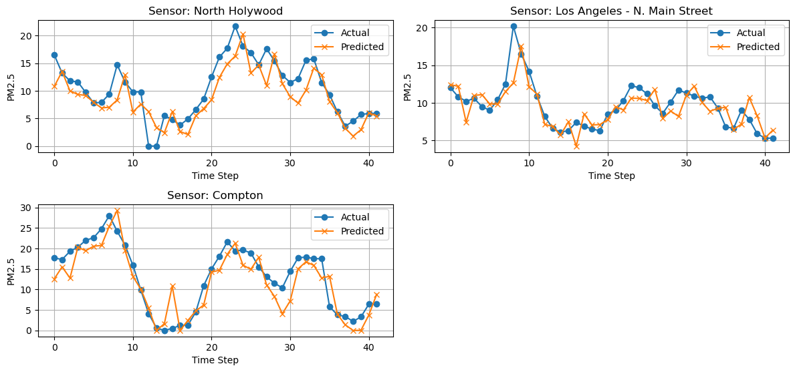
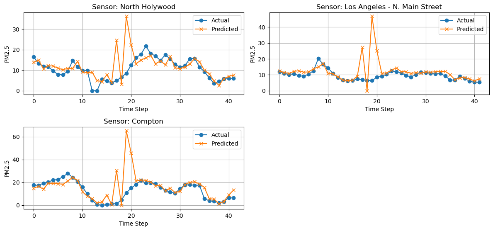
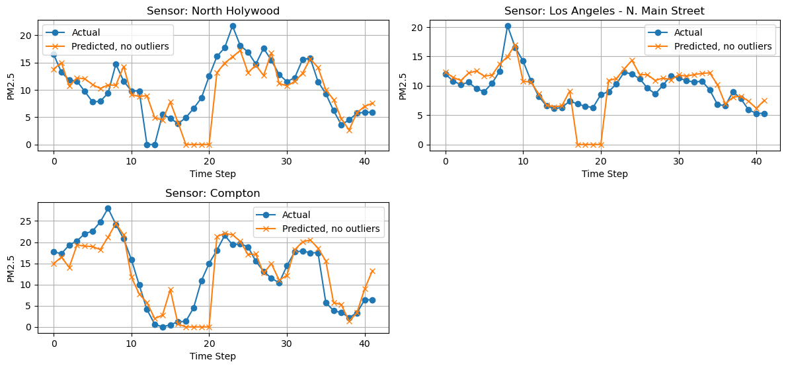
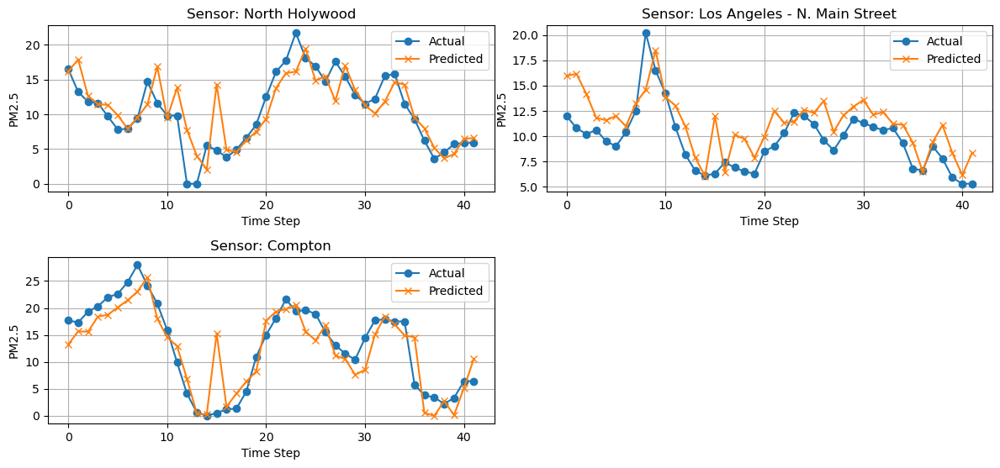

# Experiment
## Experiment 4 - week of April 14th, 2025
[Link to experiment 4](results/experiment-4/README.md)
### Summary
Three experiments with the goal of examining the effect of HRRR on the model's predicitive power for predicting next-frame AirNow PM2.5 stations.
### Settings
- IDW interpolation for AirNow sensors.
- **NEW** IDW interpolation with no mask.
- Batch size 16 -> 4.
- ~0.3 degree square bounding box, with 200x200 dimensions.
- 5 frames per sample, sliding window offset by 1 frame. 165 samples.
- Basic ConvLSTM model.
- Predicting 3 sensors
### Experiment
1. AirNow sensors as only channel.
2. HRRR and AirNow, both matching frames.
3. HRRR with 5-frame future forecast and AirNow
### Results
1. Airnow
```
RESULTS
---------------------------------------------------------------------------
All Days All Locations - y_pred vs y_test Raw RMSE: 2.97
All Days All Locations - y_pred vs y_test RMSE Percent Error of Mean: 26.96%

RESULTS BY FRAME
---------------------------------------------------------------------------
Frame 1 (Hour 1) All Locations - Raw RMSE: 4.44
Frame 1 (Hour 1) All Locations - RMSE Percent Error of Mean: 28.81%

Frame 2 (Hour 2) All Locations - Raw RMSE: 1.32
Frame 2 (Hour 2) All Locations - RMSE Percent Error of Mean: 9.61%

Frame 3 (Hour 3) All Locations - Raw RMSE: 4.23
Frame 3 (Hour 3) All Locations - RMSE Percent Error of Mean: 30.73%

Frame 4 (Hour 4) All Locations - Raw RMSE: 1.32
Frame 4 (Hour 4) All Locations - RMSE Percent Error of Mean: 9.34%

Frame 5 (Hour 5) All Locations - Raw RMSE: 1.77
Frame 5 (Hour 5) All Locations - RMSE Percent Error of Mean: 12.86%

RESULTS BY SENSOR LOCATION
---------------------------------------------------------------------------
All Days - North Holywood Raw RMSE: 3.07
All Days - North Holywood RMSE Percent Error of Mean: 29.36%

All Days - Los Angeles - N. Main Street Raw RMSE: 1.90
All Days - Los Angeles - N. Main Street RMSE Percent Error of Mean: 19.75%

All Days - Compton Raw RMSE: 3.67
All Days - Compton RMSE Percent Error of Mean: 28.24%
```

2. HRRR+AirNow (frame-by-frame) 
```
RESULTS
---------------------------------------------------------------------------
All Days All Locations - y_pred vs y_test Raw RMSE: 8.58
All Days All Locations - y_pred vs y_test RMSE Percent Error of Mean: 77.90%

RESULTS BY FRAME
---------------------------------------------------------------------------
Frame 1 (Hour 1) All Locations - Raw RMSE: 2.24
Frame 1 (Hour 1) All Locations - RMSE Percent Error of Mean: 14.52%

Frame 2 (Hour 2) All Locations - Raw RMSE: 1.18
Frame 2 (Hour 2) All Locations - RMSE Percent Error of Mean: 8.59%

Frame 3 (Hour 3) All Locations - Raw RMSE: 3.12
Frame 3 (Hour 3) All Locations - RMSE Percent Error of Mean: 22.67%

Frame 4 (Hour 4) All Locations - Raw RMSE: 1.12
Frame 4 (Hour 4) All Locations - RMSE Percent Error of Mean: 7.88%

Frame 5 (Hour 5) All Locations - Raw RMSE: 2.77
Frame 5 (Hour 5) All Locations - RMSE Percent Error of Mean: 20.17%

RESULTS BY SENSOR LOCATION
---------------------------------------------------------------------------
All Days - North Holywood Raw RMSE: 6.10
All Days - North Holywood RMSE Percent Error of Mean: 58.37%

All Days - Los Angeles - N. Main Street Raw RMSE: 7.71
All Days - Los Angeles - N. Main Street RMSE Percent Error of Mean: 80.17%

All Days - Compton Raw RMSE: 11.15
All Days - Compton RMSE Percent Error of Mean: 85.88%
```


3. HRRR+AirNow (HRRR 5-frame forecast)
```
RESULTS
---------------------------------------------------------------------------
All Days All Locations - y_pred vs y_test Raw RMSE: 3.17
All Days All Locations - y_pred vs y_test RMSE Percent Error of Mean: 28.75%

RESULTS BY FRAME
---------------------------------------------------------------------------
Frame 1 (Hour 1) All Locations - Raw RMSE: 3.46
Frame 1 (Hour 1) All Locations - RMSE Percent Error of Mean: 22.46%

Frame 2 (Hour 2) All Locations - Raw RMSE: 4.21
Frame 2 (Hour 2) All Locations - RMSE Percent Error of Mean: 30.60%

Frame 3 (Hour 3) All Locations - Raw RMSE: 3.18
Frame 3 (Hour 3) All Locations - RMSE Percent Error of Mean: 23.08%

Frame 4 (Hour 4) All Locations - Raw RMSE: 1.31
Frame 4 (Hour 4) All Locations - RMSE Percent Error of Mean: 9.21%

Frame 5 (Hour 5) All Locations - Raw RMSE: 2.42
Frame 5 (Hour 5) All Locations - RMSE Percent Error of Mean: 17.66%

RESULTS BY SENSOR LOCATION
---------------------------------------------------------------------------
All Days - North Holywood Raw RMSE: 3.06
All Days - North Holywood RMSE Percent Error of Mean: 29.25%

All Days - Los Angeles - N. Main Street Raw RMSE: 2.53
All Days - Los Angeles - N. Main Street RMSE Percent Error of Mean: 26.35%

All Days - Compton Raw RMSE: 3.79
All Days - Compton RMSE Percent Error of Mean: 29.17%
```

### Thoughts
- Sometimes, weird outliers can disappear when rerunning training.
- It seems like the 5-frame forecast is doing a better job at trying to predict. The AirNow only experiment does seem like its tracking the previous frame.
