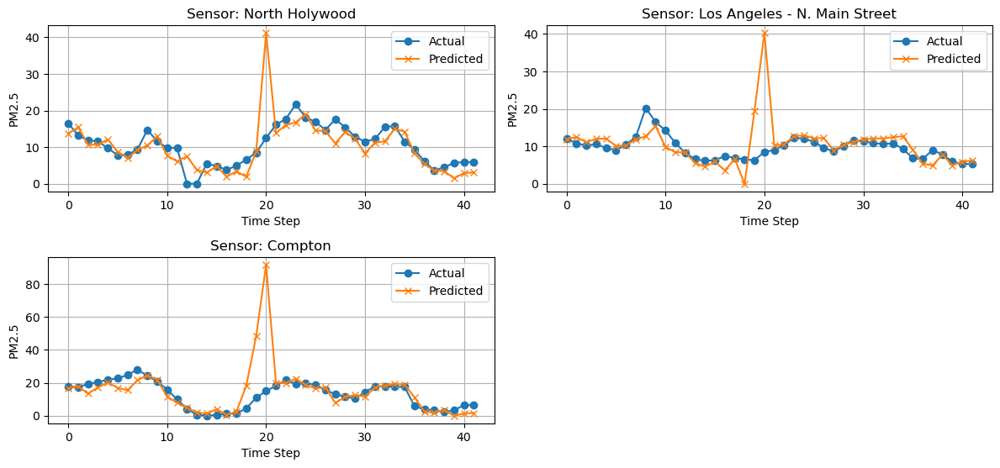
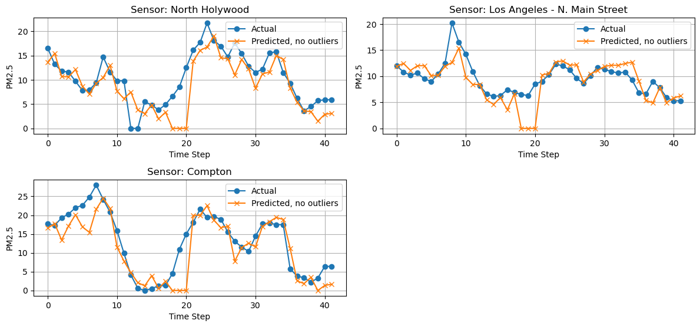
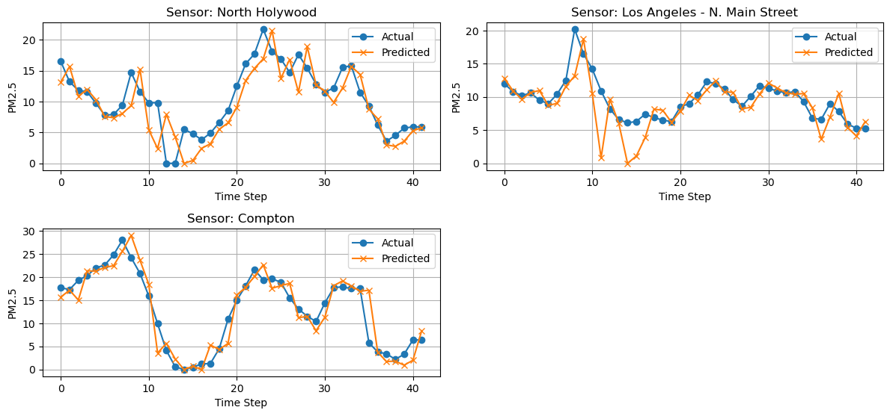
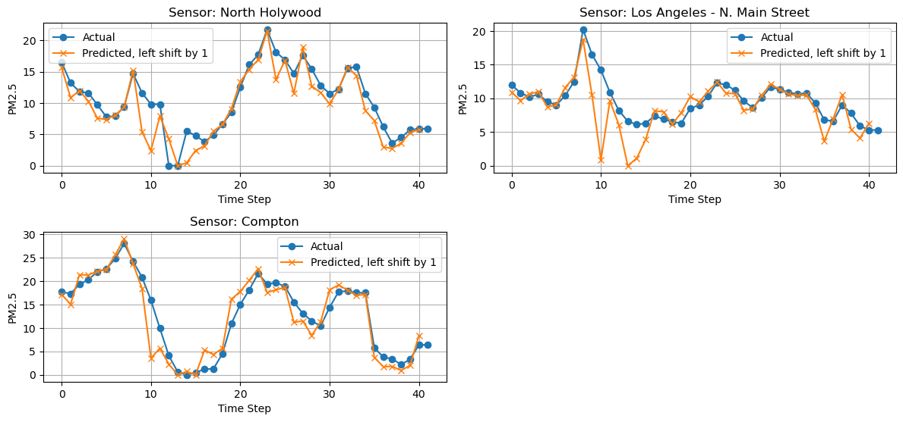

# Experiment
## Experiment 5 - week of April 21st, 2025
### Summary
Two experiments with the goal of examining the effect of HRRR on the model's predicitive power for predicting next-frame AirNow PM2.5 stations.
### Settings
- IDW interpolation for AirNow sensors.
- **NEW** IDW interpolation with mask returned.
- **NEW** `mdens` variable using `ug/m^3` instead of `kg/m^3`.
- Batch size 4.
- ~0.3 degree square bounding box, with 200x200 dimensions.
- 5 frames per sample, sliding window offset by 1 frame. 165 samples.
- Basic ConvLSTM model.
- Predicting 3 sensors
### Experiment
1. HRRR and AirNow, both matching frames.
2. HRRR with 5-frame future forecast and AirNow
### Results
1. HRRR-Airnow (frame-by-frame)
```
RESULTS
---------------------------------------------------------------------------
All Days All Locations - y_pred vs y_test Raw RMSE: 9.09
All Days All Locations - y_pred vs y_test RMSE Percent Error of Mean: 82.52%

RESULTS BY FRAME
---------------------------------------------------------------------------
Frame 1 (Hour 1) All Locations - Raw RMSE: 1.78
Frame 1 (Hour 1) All Locations - RMSE Percent Error of Mean: 11.56%

Frame 2 (Hour 2) All Locations - Raw RMSE: 1.63
Frame 2 (Hour 2) All Locations - RMSE Percent Error of Mean: 11.87%

Frame 3 (Hour 3) All Locations - Raw RMSE: 3.51
Frame 3 (Hour 3) All Locations - RMSE Percent Error of Mean: 25.46%

Frame 4 (Hour 4) All Locations - Raw RMSE: 2.07
Frame 4 (Hour 4) All Locations - RMSE Percent Error of Mean: 14.63%

Frame 5 (Hour 5) All Locations - Raw RMSE: 2.29
Frame 5 (Hour 5) All Locations - RMSE Percent Error of Mean: 16.68%

RESULTS BY SENSOR LOCATION
---------------------------------------------------------------------------
All Days - North Holywood Raw RMSE: 5.22
All Days - North Holywood RMSE Percent Error of Mean: 49.96%

All Days - Los Angeles - N. Main Street Raw RMSE: 5.77
All Days - Los Angeles - N. Main Street RMSE Percent Error of Mean: 60.00%

All Days - Compton Raw RMSE: 13.69
All Days - Compton RMSE Percent Error of Mean: 105.44%
```



2. HRRR-AirNow (5-frame forecast)
```
RESULTS
---------------------------------------------------------------------------
All Days All Locations - y_pred vs y_test Raw RMSE: 2.96
All Days All Locations - y_pred vs y_test RMSE Percent Error of Mean: 26.87%

RESULTS BY FRAME
---------------------------------------------------------------------------
Frame 1 (Hour 1) All Locations - Raw RMSE: 2.32
Frame 1 (Hour 1) All Locations - RMSE Percent Error of Mean: 15.09%

Frame 2 (Hour 2) All Locations - Raw RMSE: 1.43
Frame 2 (Hour 2) All Locations - RMSE Percent Error of Mean: 10.36%

Frame 3 (Hour 3) All Locations - Raw RMSE: 2.53
Frame 3 (Hour 3) All Locations - RMSE Percent Error of Mean: 18.41%

Frame 4 (Hour 4) All Locations - Raw RMSE: 0.64
Frame 4 (Hour 4) All Locations - RMSE Percent Error of Mean: 4.53%

Frame 5 (Hour 5) All Locations - Raw RMSE: 1.00
Frame 5 (Hour 5) All Locations - RMSE Percent Error of Mean: 7.25%

RESULTS BY SENSOR LOCATION
---------------------------------------------------------------------------
All Days - North Holywood Raw RMSE: 3.22
All Days - North Holywood RMSE Percent Error of Mean: 30.78%

All Days - Los Angeles - N. Main Street Raw RMSE: 2.66
All Days - Los Angeles - N. Main Street RMSE Percent Error of Mean: 27.65%

All Days - Compton Raw RMSE: 2.98
All Days - Compton RMSE Percent Error of Mean: 22.94%
```




## Thoughts
- Regardless, still seems to be subject to the off-by-one frame issue.
