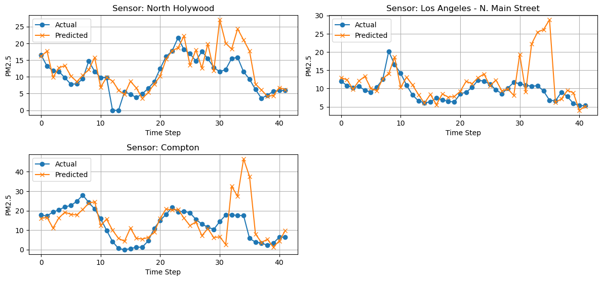
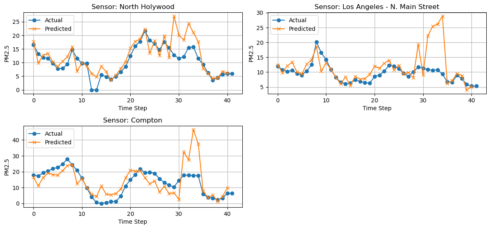
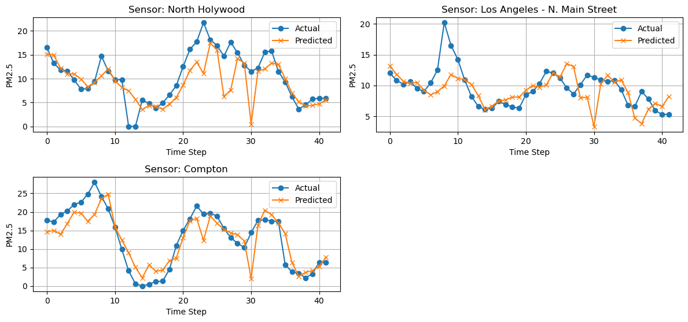
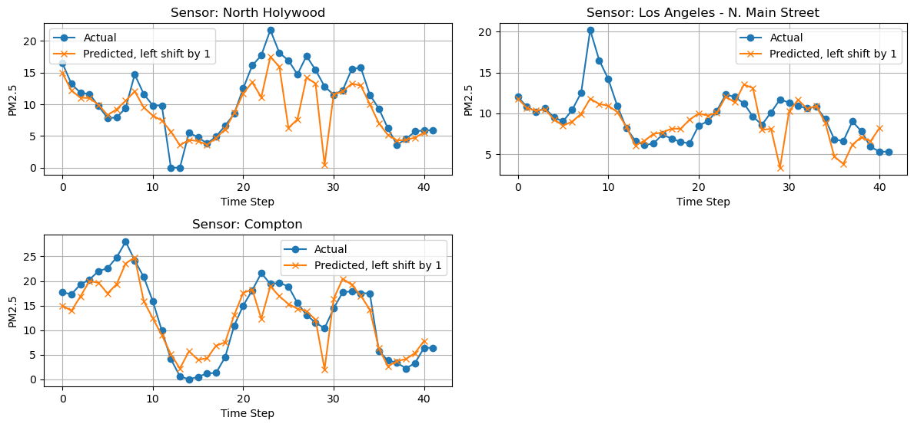

# Experiment
## Experiment 6 - week of April 21st, 2025
### Summary
Two experiments with the goal of examining the effect of HRRR on the model's predicitive power for predicting next-frame AirNow PM2.5 stations.
### Settings
- IDW interpolation for AirNow sensors.
- **NEW** returned `MASSDEN` variable back to kg/m^3 units.
- **NEW** `COLMD` variable replacing `MASSDEN`.
- Batch size 4.
- ~0.3 degree square bounding box, with 200x200 dimensions.
- 5 frames per sample, sliding window offset by 1 frame. 165 samples.
- Basic ConvLSTM model.
- Predicting 3 sensors
### Experiment
1. HRRR and AirNow, both matching frames.
2. HRRR with 5-frame future forecast and AirNow
### Results

1. HRRR+Airnow
```
RESULTS
---------------------------------------------------------------------------
All Days All Locations - y_pred vs y_test Raw RMSE: 6.52
All Days All Locations - y_pred vs y_test RMSE Percent Error of Mean: 59.19%

RESULTS BY FRAME
---------------------------------------------------------------------------
Frame 1 (Hour 1) All Locations - Raw RMSE: 1.14
Frame 1 (Hour 1) All Locations - RMSE Percent Error of Mean: 7.37%

Frame 2 (Hour 2) All Locations - Raw RMSE: 2.78
Frame 2 (Hour 2) All Locations - RMSE Percent Error of Mean: 20.20%

Frame 3 (Hour 3) All Locations - Raw RMSE: 4.89
Frame 3 (Hour 3) All Locations - RMSE Percent Error of Mean: 35.53%

Frame 4 (Hour 4) All Locations - Raw RMSE: 2.54
Frame 4 (Hour 4) All Locations - RMSE Percent Error of Mean: 17.92%

Frame 5 (Hour 5) All Locations - Raw RMSE: 3.45
Frame 5 (Hour 5) All Locations - RMSE Percent Error of Mean: 25.14%

RESULTS BY SENSOR LOCATION
---------------------------------------------------------------------------
All Days - North Holywood Raw RMSE: 4.56
All Days - North Holywood RMSE Percent Error of Mean: 43.67%

All Days - Los Angeles - N. Main Street Raw RMSE: 5.67
All Days - Los Angeles - N. Main Street RMSE Percent Error of Mean: 58.96%

All Days - Compton Raw RMSE: 8.64
All Days - Compton RMSE Percent Error of Mean: 66.53%
```



2. HRRR+Airnow (5-frame forecast)
```
RESULTS
---------------------------------------------------------------------------
All Days All Locations - y_pred vs y_test Raw RMSE: 3.59
All Days All Locations - y_pred vs y_test RMSE Percent Error of Mean: 32.62%

RESULTS BY FRAME
---------------------------------------------------------------------------
Frame 1 (Hour 1) All Locations - Raw RMSE: 2.07
Frame 1 (Hour 1) All Locations - RMSE Percent Error of Mean: 13.43%

Frame 2 (Hour 2) All Locations - Raw RMSE: 1.75
Frame 2 (Hour 2) All Locations - RMSE Percent Error of Mean: 12.68%

Frame 3 (Hour 3) All Locations - Raw RMSE: 3.12
Frame 3 (Hour 3) All Locations - RMSE Percent Error of Mean: 22.67%

Frame 4 (Hour 4) All Locations - Raw RMSE: 2.01
Frame 4 (Hour 4) All Locations - RMSE Percent Error of Mean: 14.20%

Frame 5 (Hour 5) All Locations - Raw RMSE: 1.50
Frame 5 (Hour 5) All Locations - RMSE Percent Error of Mean: 10.91%

RESULTS BY SENSOR LOCATION
---------------------------------------------------------------------------
All Days - North Holywood Raw RMSE: 3.86
All Days - North Holywood RMSE Percent Error of Mean: 36.90%

All Days - Los Angeles - N. Main Street Raw RMSE: 2.87
All Days - Los Angeles - N. Main Street RMSE Percent Error of Mean: 29.86%

All Days - Compton Raw RMSE: 3.95
All Days - Compton RMSE Percent Error of Mean: 30.45%
```


### Thoughts
- Seems like the frame-by-frame was more resistant to overfitting, but still struggled with outlier predictions.
- I wonder why the 5-frame forecasts are less effective. Would like to try sequence to sequence prediction, and see how that will affect results.
