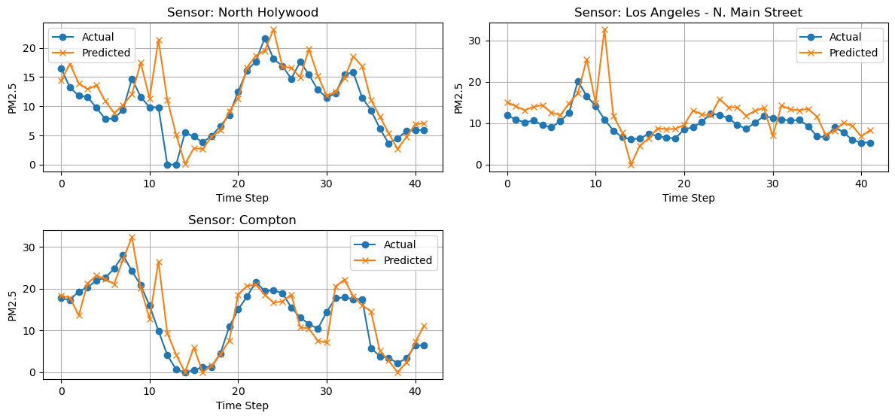
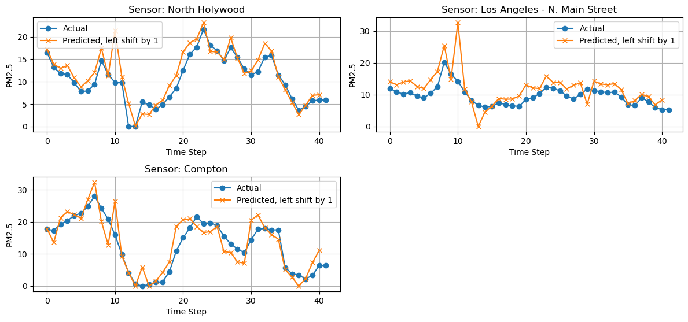
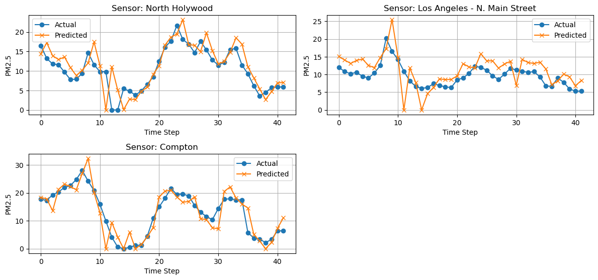
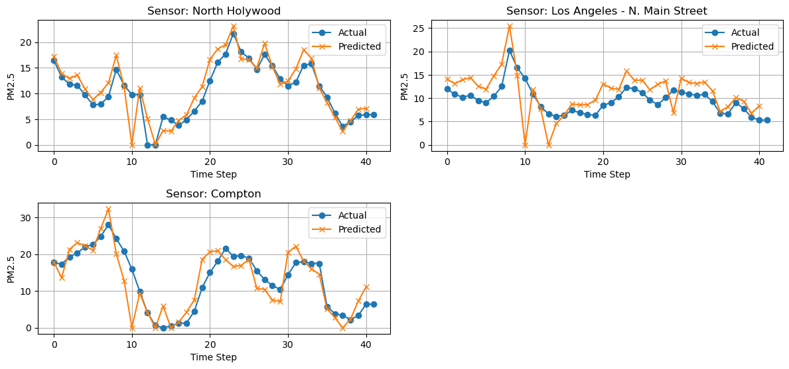

# Dropout
## Predictions and left-shift by 1

## Predictions with outlier removed, and left-shift by 1

## Thoughts
- Dropout seems to be helping, which indicates the left-shift issue is likely one of the ways in which a timeseries predictive model can be overfit.
# Batch Normalization
- Just doesn't work, need to tweak it. Loss stays at ~20 for 150 epochs.
